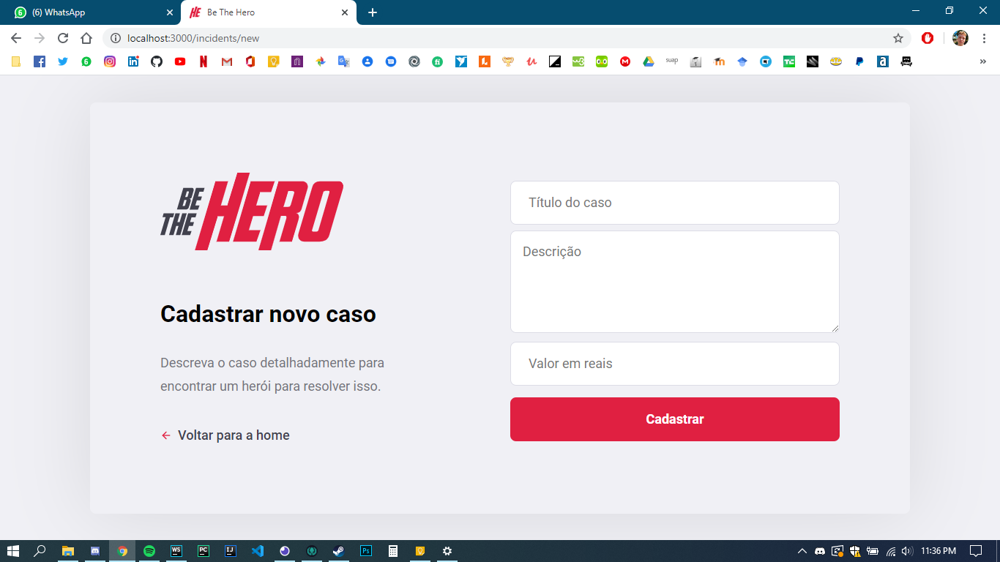

# Introduction
This full stack project had been developed during the **Semana Omnistack 11**.
The objective is to create a website where NGOs can request a currency help
and people can help by donating money.

The following technologies had been used in order to build this project:
- **web server:** NodeJS with Express
- **database:** SQLite through Knex
- **web interface:** React
- **mobile:** React Native through Expo
- **validations:** Celebrate/Jest
- **tests:** Supertest

# Samples of its Web Interface
### Homepage

### Sign in

### Register NGO

### Register incident

