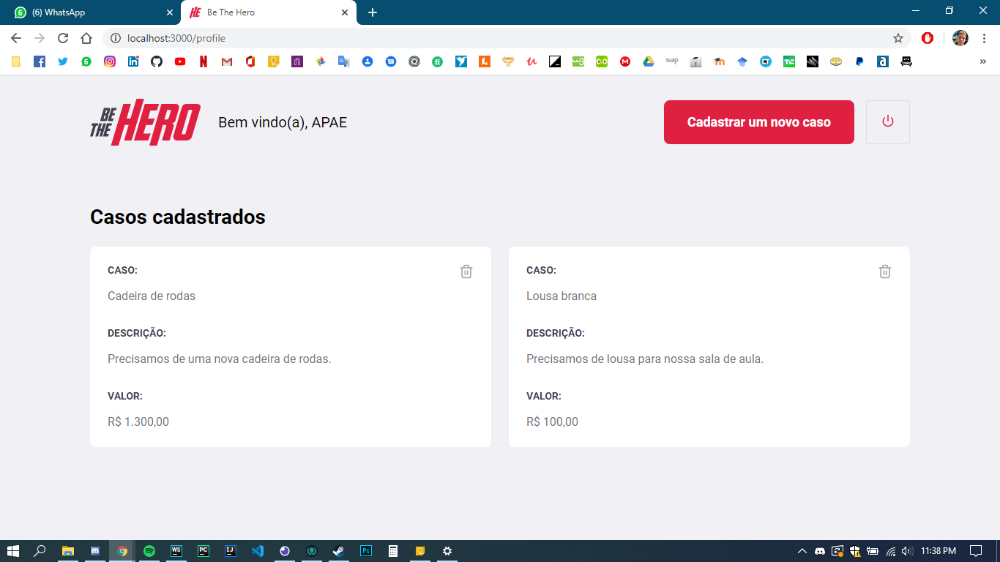
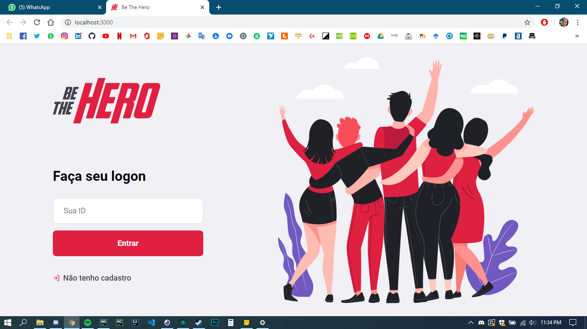
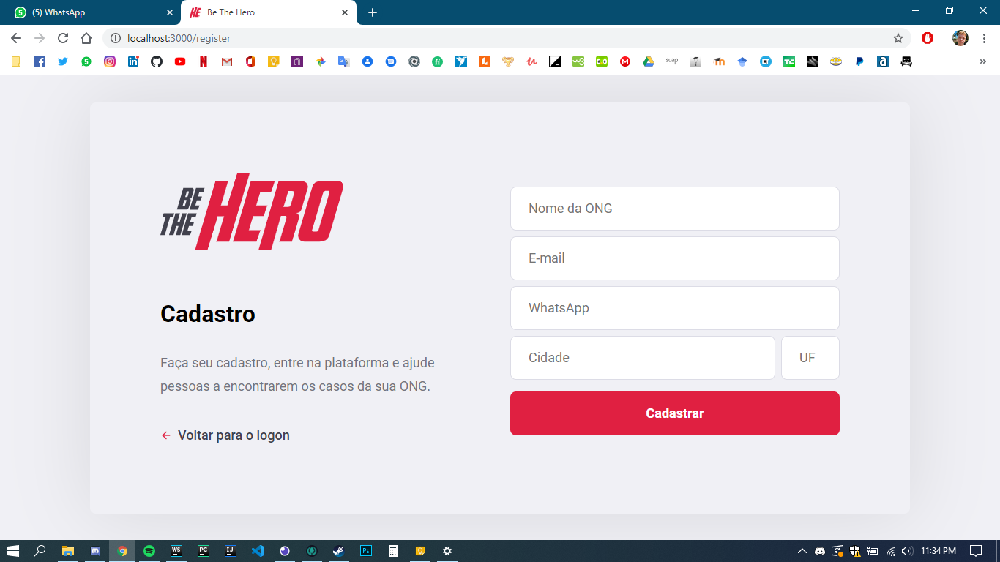
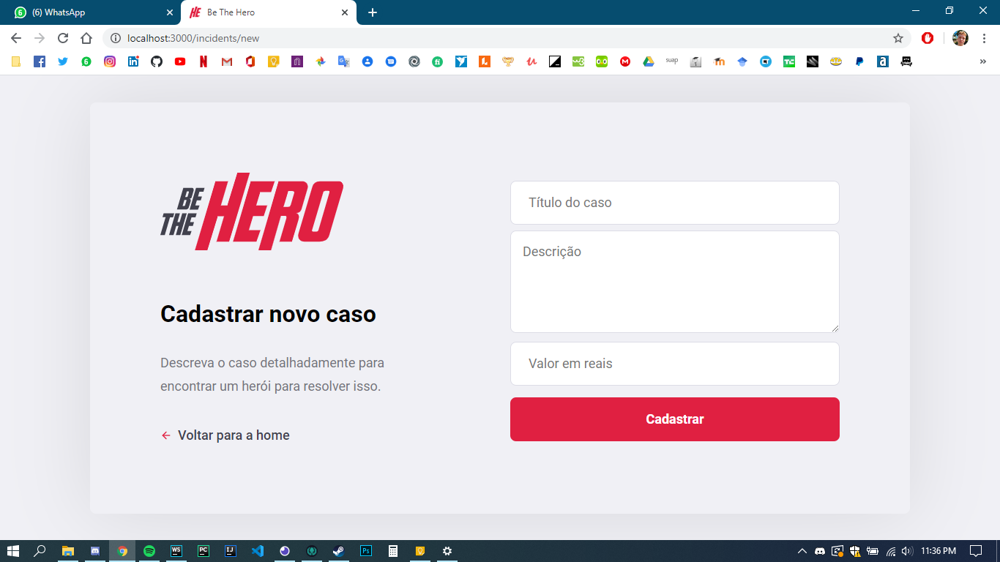

This full stack project  had been developed during the **Semana Omnistack 11**.
The objective is to create a website where NGOs can register a currency help
and people can donate them money.

The following technologies had been used in order to build this project:
- **web server:** NodeJS with Express
- **database:** SQLite through Knex
- **web interface:** React
- **fetching JSON data:** Axios
- **mobile:** React Native through Expo
- **validations:** Celebrate/Jest
- **tests:** Supertest

###Here some samples of its interface on web

#### Homepage:

#### Sign in:

#### Register NGO:

#### Register incident

