BeTheHero
==

- [BeTheHero](#bethehero)
- [Introduction](#introduction)
- [How to run](#how-to-run)
  - [Server](#server)
  - [Web](#web)
  - [Mobile](#mobile)
- [Interface](#interface)
  - [Web interface](#web-interface)
  - [Mobile interface](#mobile-interface)
- [Author](#author)

Introduction
==

This full stack project had been developed during the **Semana Omnistack 11** in order to practice some web frameworks and concepts.
However, this is not a copy of the workshop project, I have made some changes and features upgrades.

> **BeTheHero** is a platform where NGOs can request a currency support and common people can help by donating money to their cases.

The following technologies had been used in order to build this project:

- **web server:** NodeJS with Express
- **database:** SQLite through Knex
- **web interface:** React
- **mobile:** React Native through Expo
- **validations:** Celebrate/Jest
- **tests:** Supertest

How to run
==

⚠️ Make sure you are in the project's directory.

Server
--

**Note: make sure your NodeJS is updated.**

First, update the _package.json_ modules.

`> npm update`

Then you'll be able to install the modules.

`> npm install`

Now you're you can run the server.

`> npm start`

Now your server application must be running in the selected address.
You can now execute web and/or mobile application.

Web
--

First, update the _package.json_ modules.

`> npm update`

Then you'll be able to install the modules.

`> npm install`

Now you're you can run the server.

`> npm start`

Now the development server will run and the addresses of your application will appear on Terminal.
The website will also open automatically in your browser.

Mobile
--

First, update the _package.json_ modules.

`> npm update`

Then you'll be able to install the modules.

`> npm install`

Now you're you can run the server.

`> npm start`

Now the Expo DevTools will open in your browser as well as the Metro Bundler.
There, you'll be able to choose where you'll run your application.
You can choose between:

- Android device or emulator
- iOS device or emulator
- Web browser (emulated)

**if any errors occurred, try to run the following command:**

>`> npm audit fix`

and the packages will be fixed.

Interface
==

Web interface
--

**Login screen**

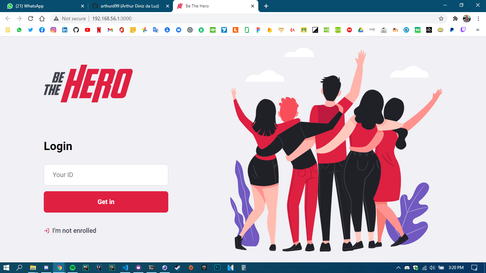

**Homepage**

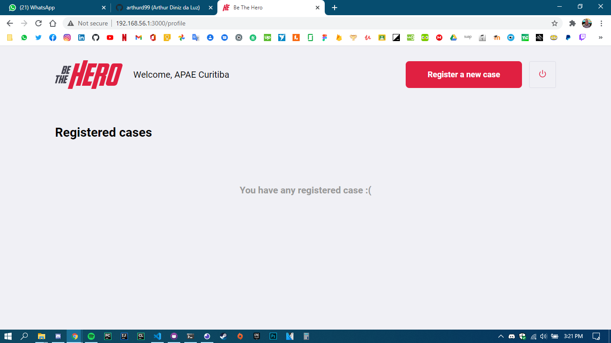

**Homepage with cases**

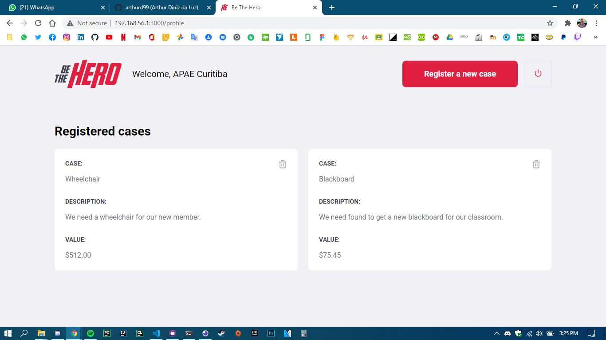

**NGO sign up**

**NGO sign up (fulfilled)**

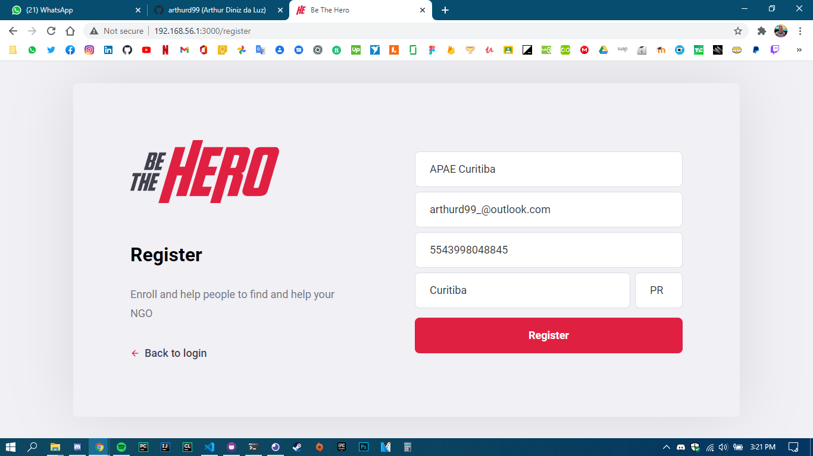

**Case register**

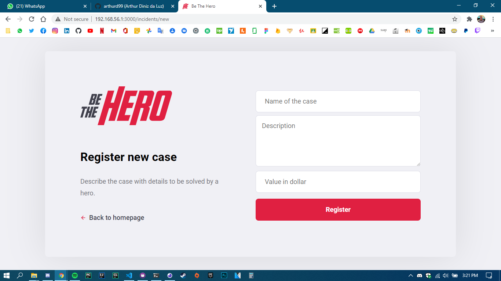

**Case register (fulfilled)**

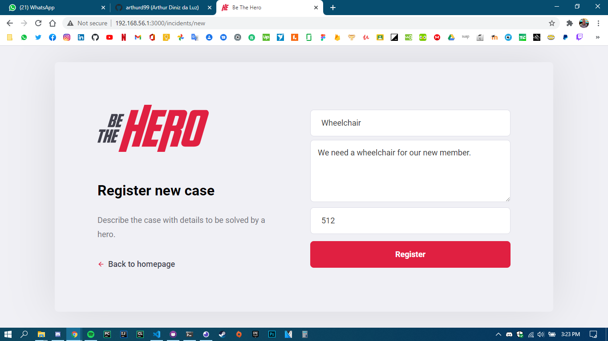

Mobile interface
--

**Loading screen**

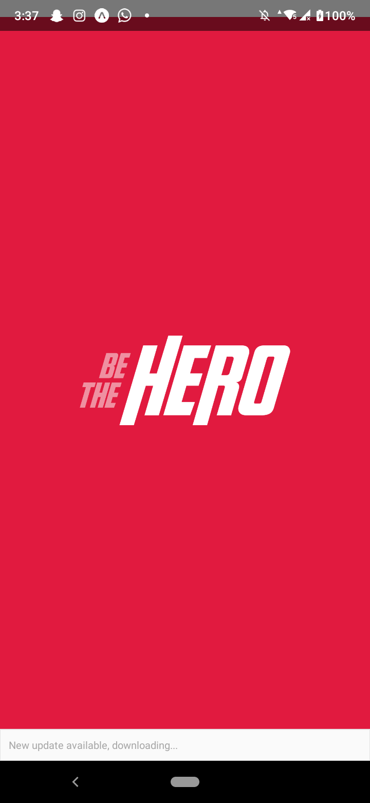

**Home screen**

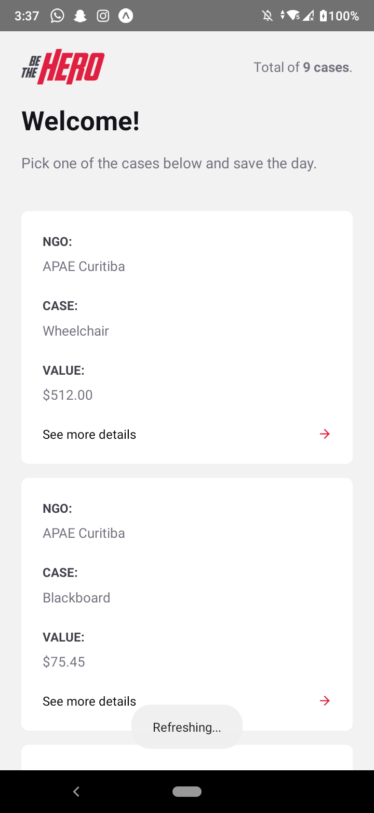

**Case screen**

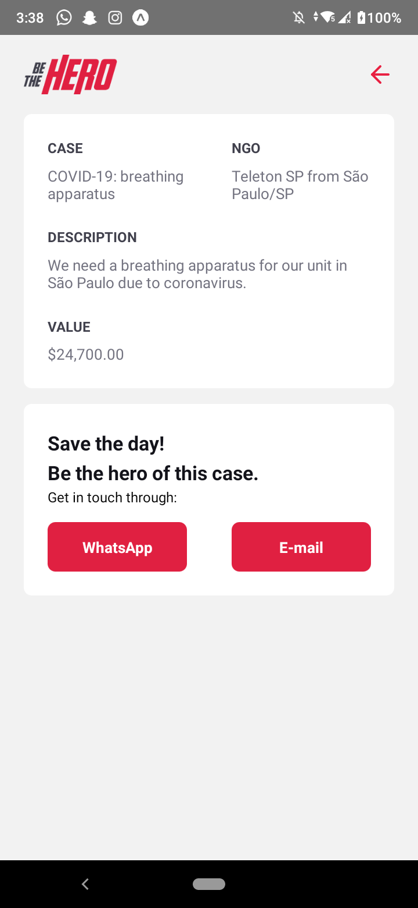

**Texting through WhatsApp**

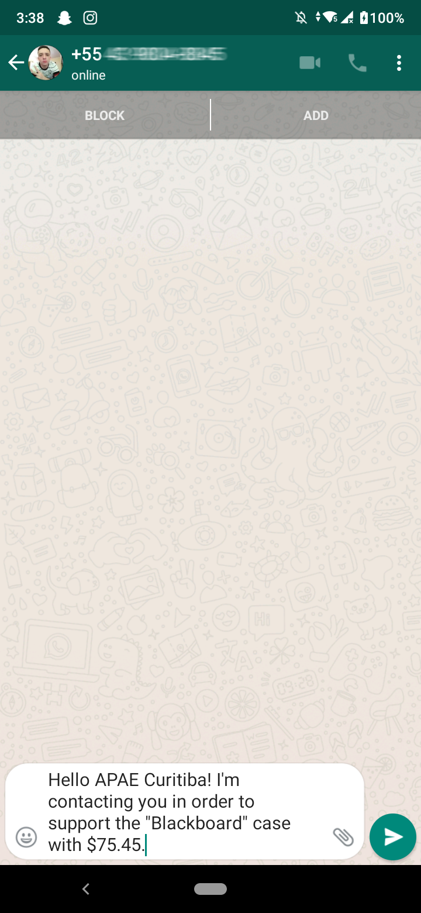

**Texting through E-mail**

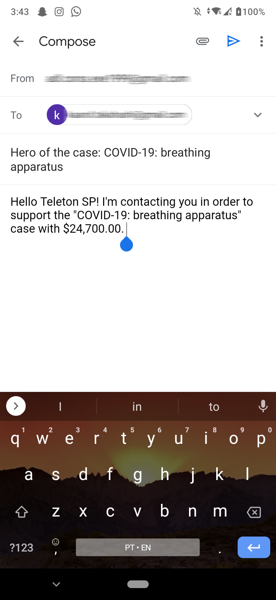

Author
==

This project has been uploaded by [Arthur Diniz da Luz](https://arthurd99.github.io/).
